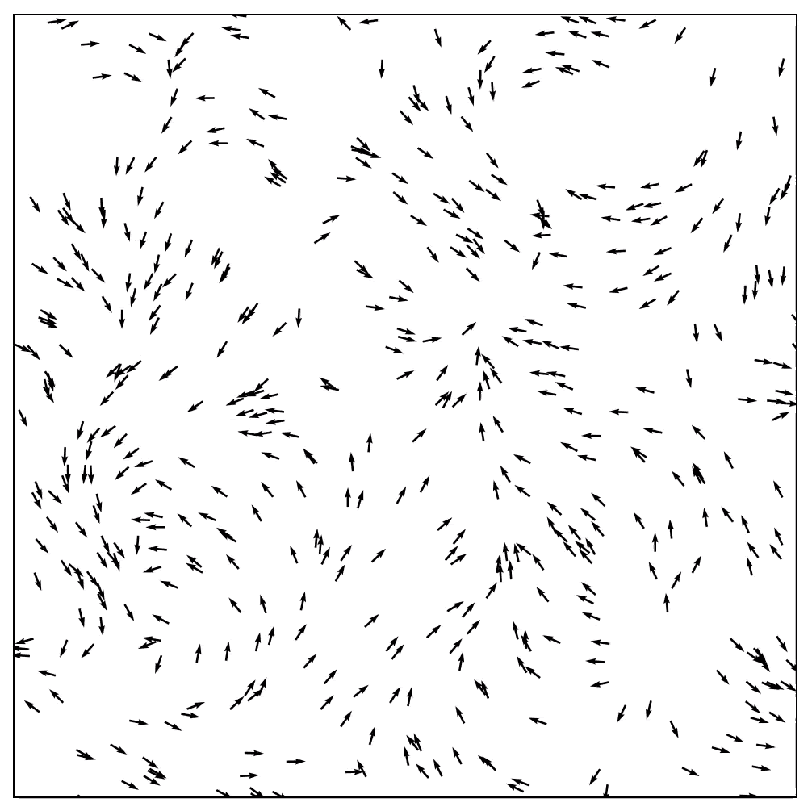
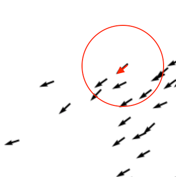

# HPC - Active Matter
> This repository contains the code of the Viscek active matter simulation algorithm in serial C++ and the code accelerated with OpenMP, MPI and CUDA.



## Algorithm

The Vicsek algorithm, introduced by Tamás Vicsek and his collaborators in 1995, is a computational model used to simulate the collective behavior of active matter, e.g. flocking of birds.

However, the rules are simple:

- Each agent moves at a constant speed in a 2D plane.
- At each time step, the particle's direction is updated based on the average direction of neighboring particles within a certain radius, as shown below.
- Random noise is added to simulate environmental stochasticity.




## Serial

> First, we'd like to say thank you to [Philip Mocz](https://github.com/pmocz/activematter-python) for the reference of the Viscek algorithm implementation.

The serial code was implemented in C++ 11 standard with many optimization, which cut down most of the Pow computaion. The serial code locates in the [./CPP/activeMatter_rawPtr.cpp](./CPP/activeMatter_rawPtr.cpp). 

**Usage:** 
``` shell
cd ./CPP
g++ -std=c++11 ./activeMatter_rawPtr.cpp -o activeMatter.out
./activeMatter.out 3000  # takes one argument as the bird number, 500 by default
# if the output is enabled, there should be a text file ./output.plot
python3 ./plot.py # show the animation of the simulation result
```

**Enable the output:** 
Control the output during the compile time with: 
```c++
constexpr bool OUTPUT_TO_FILE = true;
```
For more details, see the doxygen docs.

## Parallel


### MPI

The code locates in [./HPC/MPI/activeMatter_MPI_rawPtr.cpp](./HPC/MPI/activeMatter_MPI_rawPtr.cpp).

Please refer to the [MPI readme](./HPC/MPI/README.md) or the doxygen docs for more details.

### OpenMP

The code locates in [./HPC/OpenMP/activeMatterHPC.cpp](./HPC/OpenMP/activeMatterHPC.cpp).

Please refer to the [OpenMP readme](./HPC/OpenMP/README.md) or the doxygen docs for more details.


### CUDA

The code locates in [./CUDA/activeMatterCUDA.cu](./CUDA/activeMatterCUDA.cu).

Please refer to the [CUDA readme](./CUDA/README.md).


## Doxygen docs

Basically every code file in this project has annotations in doxygen format. it's easy to genegrate the doc with:

``` shell
doxygen
```

And the docs should be in the `./docs` folder now.

